# Flight-Booking-Application
Flight Booking Application - Spring Boot, Node.js, JWT, React, MongoDB, MySQL, Razorpay

## Overview

  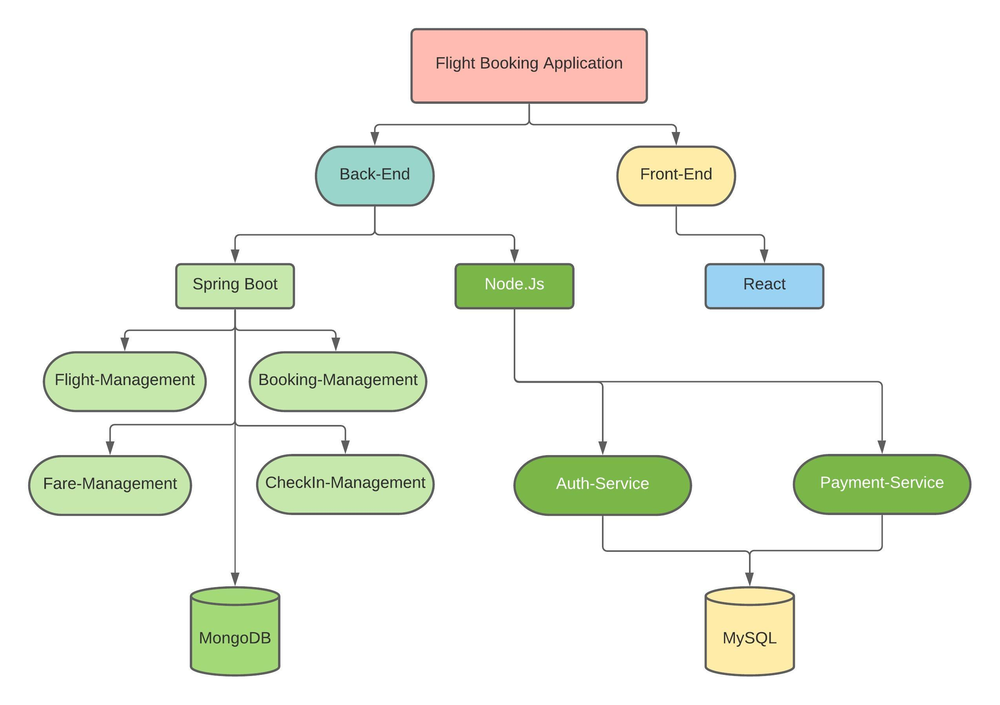

## Technology Stack

- Spring Boot
- Node.js
- React
- MongoDB
- MySQL
- Extras (JWT Security, Razorpay Payment Gateway )

## Folder Structure

- Back-End
- - Spring Boot
- - Node.js

- Front-End
- - React

## Project Initialization

- Clone the project

- For Spring Boot

        import Spring Boot into STS/Eclipse
        Update Project using Maven (All Microservices)
        run eureka-server
        run rest of them
        

- For Node.js

        cd Back-End
        cd Node.js
        cd auth-service
        node auth
        //
        cd Node.js
        cd payment-service
        node payment

- For React

        cd Front-End
        cd React
        cd flight-booking
        npm i
        npm start
       // or
        yarn add
        yarn start

 

## Project UI

<h2 style="color: #323dfa; font-weight:500"> Register </h2>

  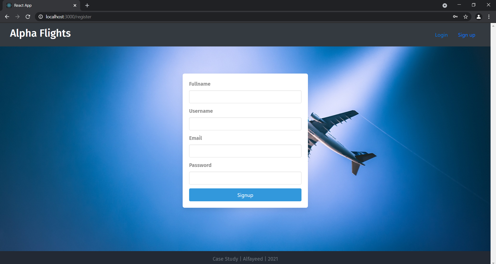

<h2 style="color: #323dfa; font-weight:500"> Login </h2>

  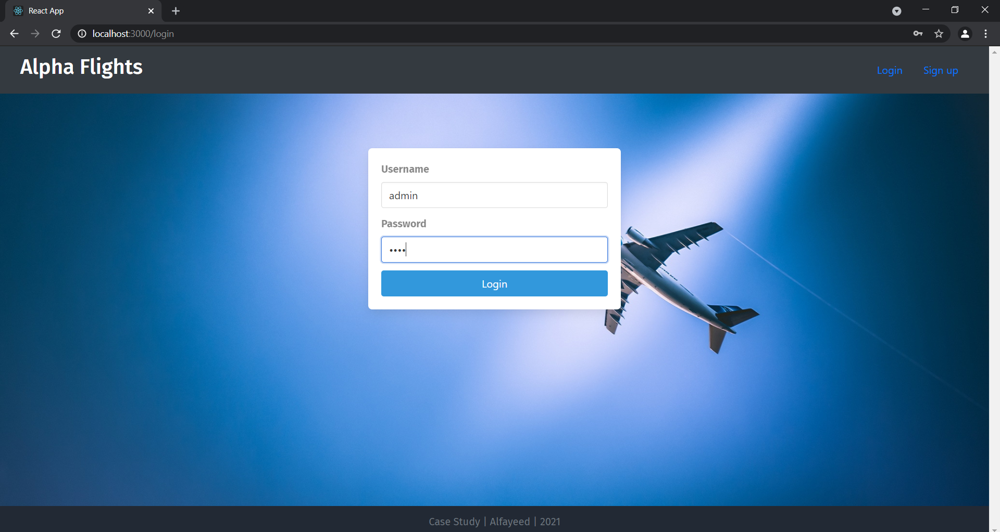

<h2 style="color: #323dfa; font-weight:500"> Search </h2>

  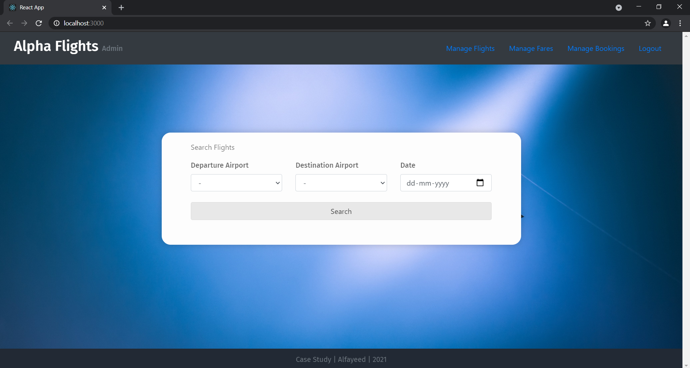

<h2 style="color: #323dfa; font-weight:500"> Searched </h2>

  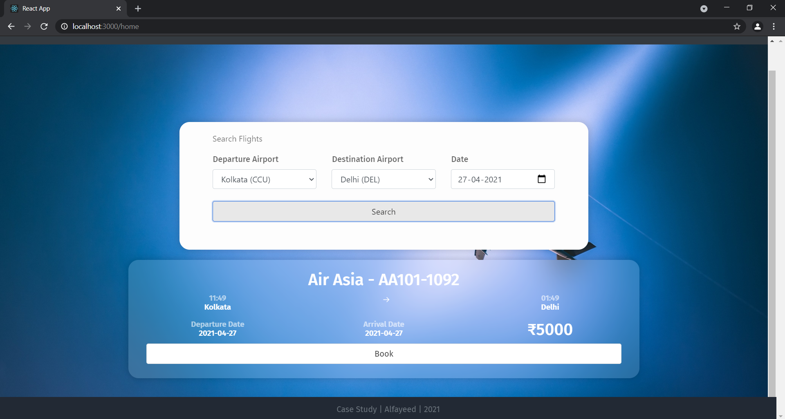

<h2 style="color: #323dfa; font-weight:500"> Booking </h2>

  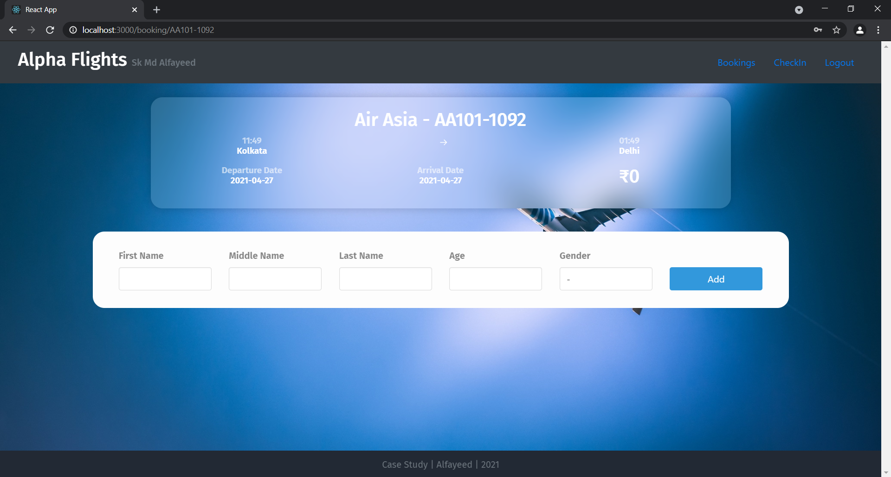

<h2 style="color: #323dfa; font-weight:500"> Passenger </h2>

  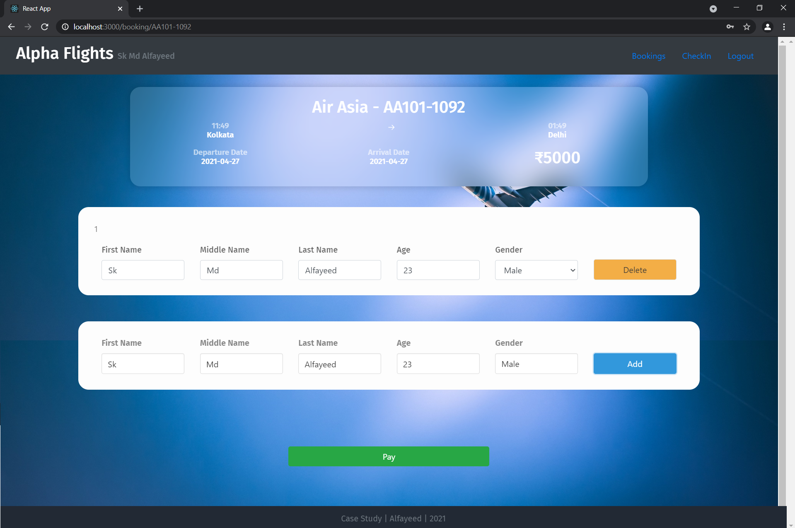

<h2 style="color: #323dfa; font-weight:500"> Razorpay </h2>

  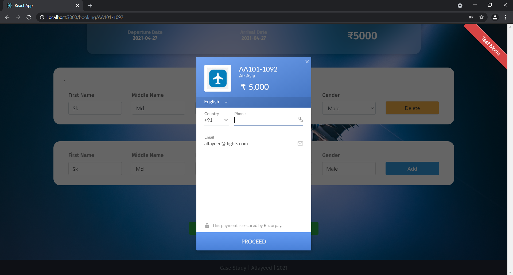

<h2 style="color: #323dfa; font-weight:500"> Checkin </h2>

  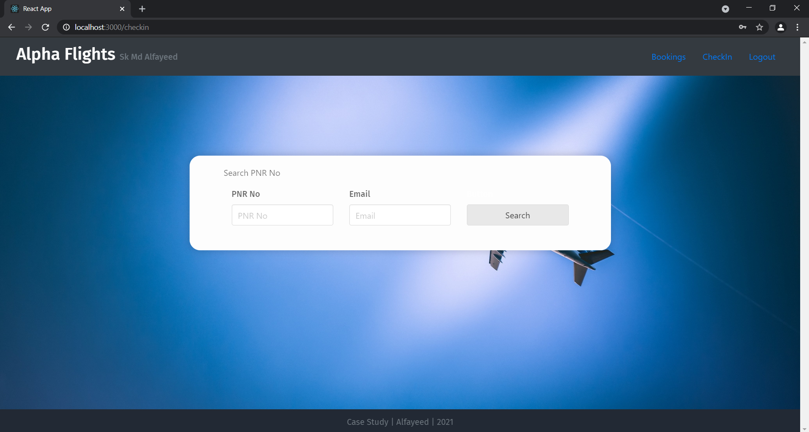

<h2 style="color: #323dfa; font-weight:500"> CheckedIn </h2>

  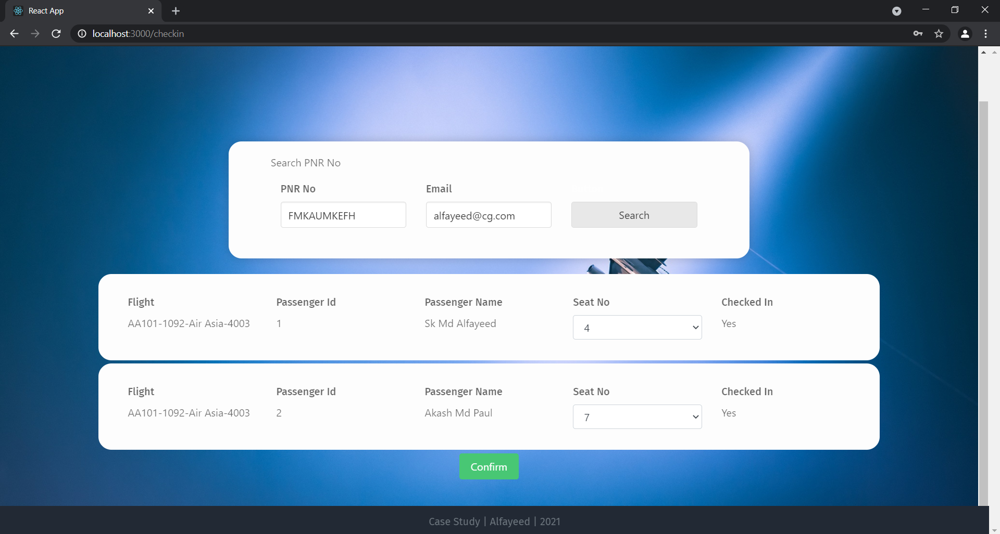

<h2 style="color: #323dfa; font-weight:500"> Flight Manage </h2>

  

<h2 style="color: #323dfa; font-weight:500"> Add Flights </h2>

  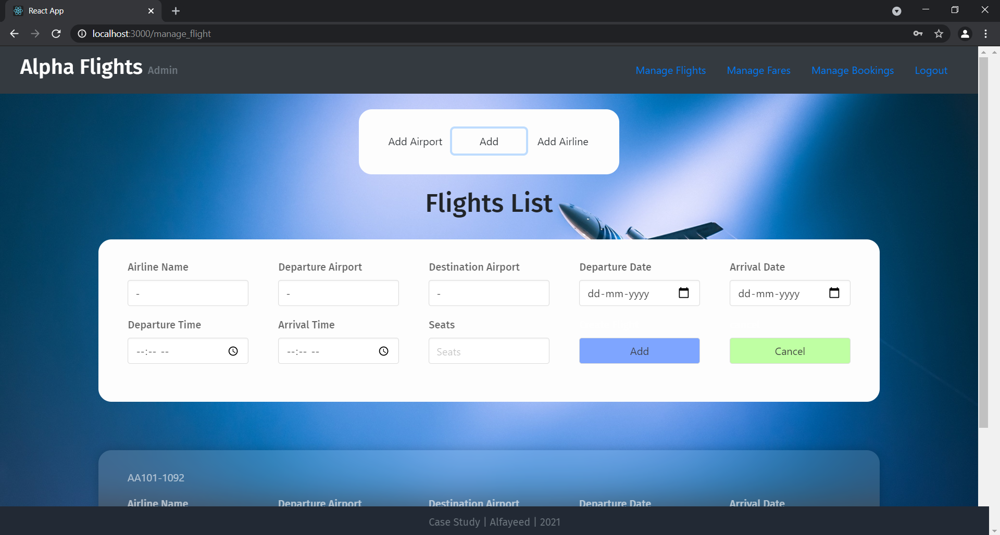

<h2 style="color: #323dfa; font-weight:500"> Validation </h2>

  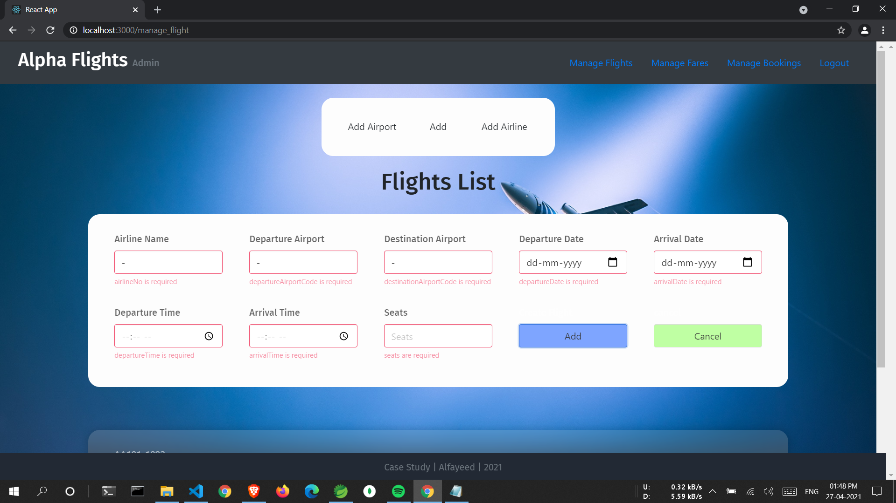

<h2 style="color: #323dfa; font-weight:500"> Fare Manage </h2>

  

<h2 style="color: #323dfa; font-weight:500"> Booking Manage </h2>

  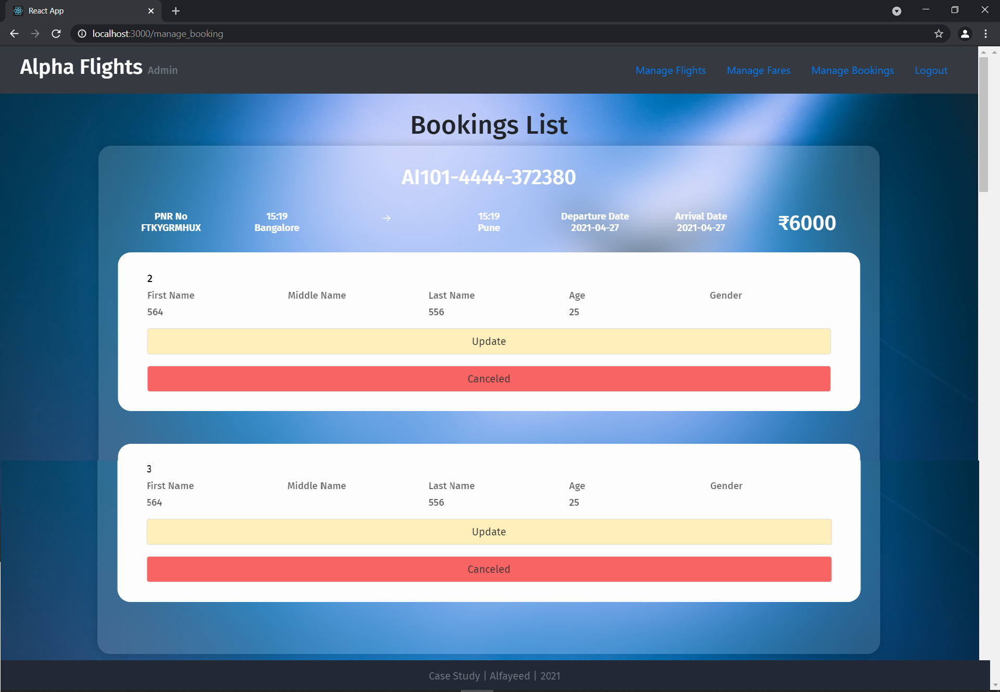

